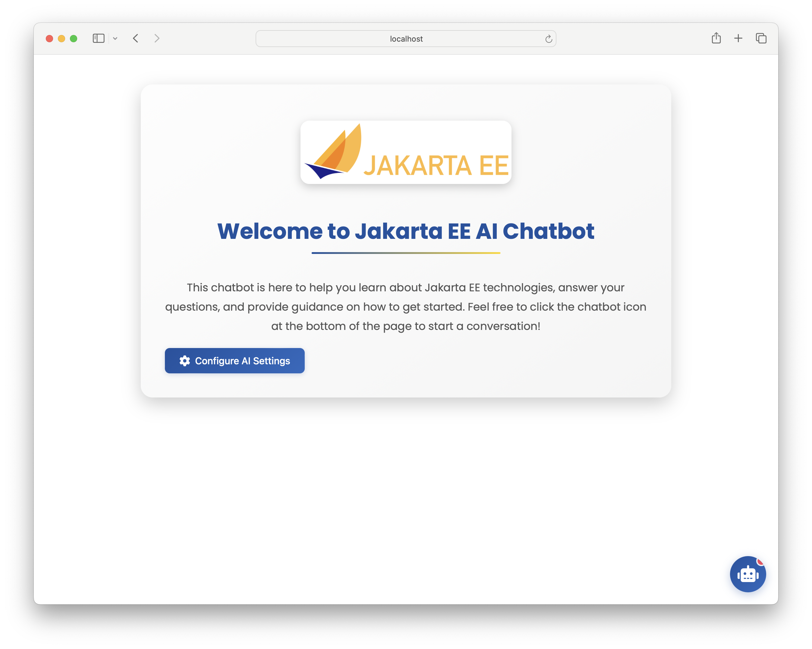
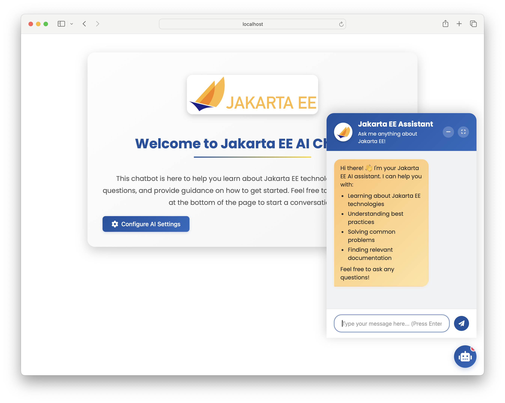
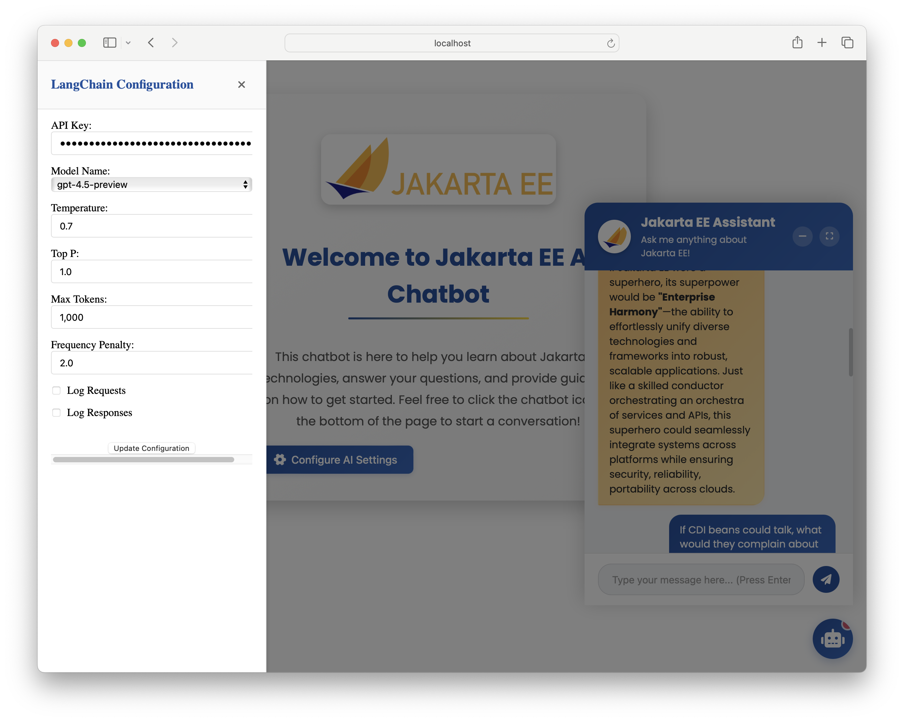
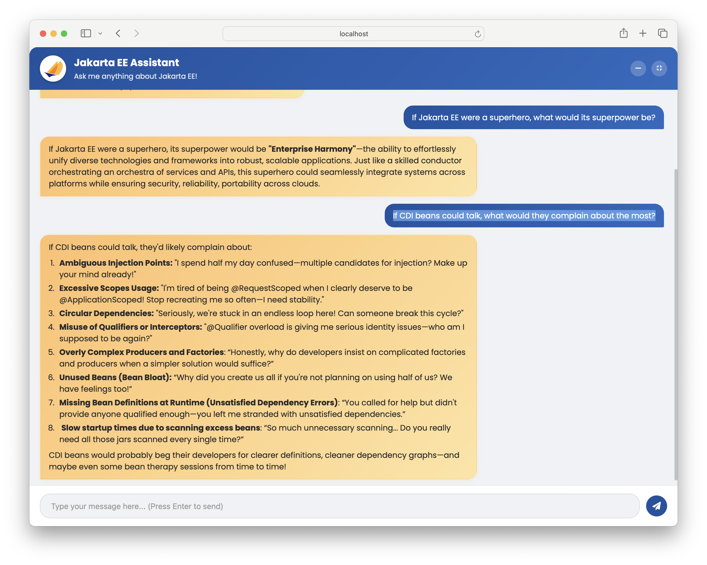

# Jakarta EE AI Chatbot

This Jakarta EE AI Chatbot is designed to help users learn about Jakarta EE technologies, answer their questions, and provide guidance on how to get started. The chatbot integrates with OpenAI's API to provide intelligent, conversational responses.

## Features

- User-friendly interface for interacting with the chatbot
- AI-powered responses to technical and general questions
- Built using Jakarta EE, showcasing modern enterprise Java capabilities
- Progressive implementation steps from basic chatbot to advanced features
- Retrieval-Augmented Generation (RAG) capabilities
- Multi-model support
- Advanced tools integration

## Project Structure

The project is organized into progressive steps, each building upon the previous one:

1. **step-00-chatbot-first-step**: Basic chatbot implementation with OpenAI integration
2. **step-01-prompts**: Enhanced prompt engineering and response handling
3. **step-02-chat-memory**: Implementation of chat history and context management
4. **step-03-tools**: Integration with external tools and APIs
5. **step-04-inmemory-rag**: Basic in-memory Retrieval-Augmented Generation
6. **step-05-easy-rag**: Simplified RAG implementation with improved retrieval
7. **step-06-advanced-rag**: Advanced RAG features with better context handling
8. **step-07-multi-model**: Support for multiple LLM models
9. **step-08-advanced-tools-and-rag**: Combined advanced tools with RAG capabilities

---

## Prerequisites

### Required for Basic Operation
1. **Java 17 or higher**: The project is built with Jakarta EE and requires Java 17+
2. **Maven**: For building and managing dependencies (or use the included mvnw wrapper)
3. **OpenAI API Key**: Required for all steps. Set the environment variable:
   ```bash
   export OPENAI_API_KEY=your-api-key-here
   ```

### Required for Advanced Features
1. **Document Directory** (for RAG features in steps 04-06):
   ```bash
   export LLM_JAKARTA_DOCUMENTS_DIR=/path/to/your/documents
   ```
2. **PostgreSQL Database** (for steps with persistence):
   - Use the provided Docker Compose file in the `deploy` directory
   - Or configure your own PostgreSQL instance

### Optional Components
1. **Additional LLM API Keys**: For multi-model support (step-07)
2. **Tool-specific Configurations**: For advanced tool integration (steps 03 and 08)

---

## Setup Instructions

1. **Clone the Repository**: Clone this project to your local machine.
   ```bash
   git clone git@github.com:rokon12/llm-jakarta.git
   cd llm-jakarta
   ```

2. **Set the OpenAI API Key**: Export your OpenAI API key to an environment variable.
   ```bash
   export OPENAI_API_KEY=<your-api-key>
   ```

3. **Build and Run the Application**: Use the following command to clean, package, and start the application in development mode with WildFly.
   ```bash
   ./mvnw clean package wildfly:dev
   ```

4. **Access the Application**: Once the application starts, open your browser and navigate to:
   ```
   http://localhost:8080/llm-jakarta
   ```
5. **Additional Step for RAG Feature (Step 04-06)**: When leveraging the RAG (Retrieval-Augmented Generation) feature, you must specify the directory containing the documents by exporting the following variable

 ```shell
 export LLM_JAKARTA_DOCUMENTS_DIR=<document_dir>
 ```
Replace `<document_dir>` with the path to your documents directory.

**Some of the steps require a database.** To simplify we have added a docker-compose.yml in the "deploy" directory.
 ```shell
 docker-compose up
 ```


---

## Screenshots

### Welcome Page


### Chat Interface


### Configuration Interface


### Full Screen Chat View


### Tool Integration Example


---

## Detailed Setup Guide

### Basic Setup (Step 00-02)
1. Follow the general setup instructions above
2. Each step can be run independently using:
   ```bash
   cd step-XX-name
   ../mvnw clean package wildfly:dev
   ```

### Tools Integration (Step 03)
1. Configure the necessary API keys in the configuration interface
2. Tools are automatically discovered and integrated
3. Access the tools through the chat interface using natural language

### RAG Setup (Steps 04-06)
1. Prepare your document directory with PDF files
2. Export the documents directory:
   ```bash
   export LLM_JAKARTA_DOCUMENTS_DIR=/path/to/your/documents
   ```
3. Different RAG implementations:
   - Step 04: In-memory RAG (suitable for small document sets)
   - Step 05: Basic RAG with vector storage
   - Step 06: Advanced RAG with improved context handling

### Multi-Model Setup (Step 07)
1. Configure additional model API keys if needed
2. Models can be selected through the configuration interface
3. Different models can be used for different types of queries

### Advanced Features (Step 08)
1. Combines RAG capabilities with tool integration
2. Requires both document directory and tool configurations
3. Provides the most comprehensive chatbot experience

---

## Usage

1. Open the app in your browser using the URL: `http://localhost:8080/llm-jakarta`.
2. Start a conversation by clicking on the chatbot icon in the bottom-right corner.
3. Ask any questions related to Jakarta EE or general queries, and the chatbot will respond with AI-powered insights.

---

## Contributions

We welcome contributions to enhance this chatbot. If you'd like to contribute, feel free to fork the repository, make your changes, and create a pull request.

---

## License

This project is licensed under the [MIT License](LICENSE).
